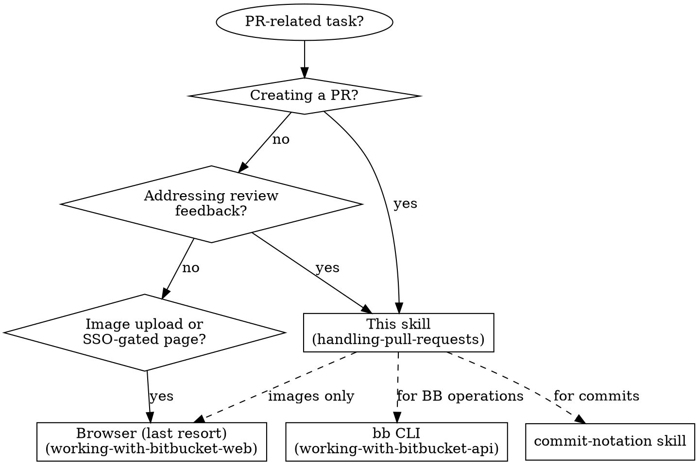

# Handling Pull Requests

## When to Use This Skill



---

## PR Creation Workflow

### Pre-flight Checklist

```
- [ ] Branch pushed to remote
- [ ] All commits follow commit-notation
- [ ] Tests passing locally
- [ ] Reviewer identified
```

### PR Description Template

```markdown
## Summary
[1-3 sentences: what this PR does and why]

## Changes
- Change 1
- Change 2

## Test plan
- [ ] Test case 1
- [ ] Test case 2

---
Generated with Claude Code
```

### Steps

1. **Push branch** if not already pushed
2. **Determine target branch** — check the repo's default branch (usually `develop` for Quatico repos). Use `--base` if it differs from the repo default.
3. **Fill description** using template above
4. **Add reviewers** as identified
5. **Create PR**: `bb pr create --title "..." --body "..." --base develop --reviewer "Name"`
6. **Verify** with `bb pr view <id>` — **check the `Dest:` line** to confirm the target branch is correct

> **Always use `bb` CLI** for Bitbucket PR operations (create, edit, comment, approve, merge). It handles markdown descriptions, reviewer management, and all PR lifecycle operations. See `bb --help`. Browser is only needed for image uploads. If `bb` is not installed, stop and guide the user through setup (`install-dependencies.sh` + `bb auth login`) before proceeding.

> **Target branch matters.** `bb pr create` auto-detects the repo's default branch via the Bitbucket API. If auto-detection fails, it falls back to `main`. For repos that use `develop` (all Quatico repos), always pass `--base develop` explicitly to be safe. If a PR was created with the wrong target, fix it with `bb pr edit <id> --base develop`.

---

## Addressing Review Feedback

### Process

1. **Read ALL comments first** — don't fix piecemeal: `bb pr view <id> --comments`
2. **Categorize each comment**:
   - **Question** → needs reply
   - **Change request** → needs code change + reply
   - **Approval/praise** → acknowledge or resolve
3. **Make code changes** for all change requests
4. **Commit with notation**: `b: Address review feedback` (or more specific)
5. **Reply to comments** explaining what was done: `bb pr comment <id> --body "..."`
6. **Resolve comments** that were fully addressed: `bb pr comment <id> --resolve <comment_id>`
7. **Push changes**

### Comment Response Checklist

```
- [ ] Read all comments
- [ ] Make code changes
- [ ] Commit changes
- [ ] Reply to each comment
- [ ] Resolve fully-addressed comments (where possible)
- [ ] Push
```

---

## Replying to Comments

### When to Reply vs Resolve

| Action | Use When |
|--------|----------|
| **Reply** | Questions, discussions, explanations, disagreements |
| **Resolve** | Task completed, feedback acknowledged and implemented |

### AI Signature Convention

When Claude posts comments on behalf of a user, **always sign**.

**Format:** *🤖 – [Model Name]* in italic (if the editor supports it)

Example: *🤖 – Claude*

**Placement:**
- **Inline:** Add at end of your reply: `...fixed in commit abc123.` *🤖 – Claude*
- **Own line:** Start a new paragraph directly after your text—no blank line above or below

**Why:** Prevents impersonation and maintains transparency. The signature should be unobtrusive but always present.

### Reply Guidelines

- Be concise and direct
- Reference specific code changes if applicable
- Use platform's rich text editor carefully (see platform skill)

---

## Integration with Other Skills

| Skill | Use For |
|-------|---------|
| `working-with-bitbucket-api` | **Primary**: all Bitbucket operations via `bb` CLI |
| `commit-notation` | Commit messages (F:, B:, R:, etc.) |
| `markdown` | CommonMark formatting for PR descriptions and comments |
| `writing-clearly-and-concisely` | PR descriptions and comments |
| `working-with-bitbucket-web` | Last resort: image uploads, SSO pages |

---

## Common Mistakes

| Mistake | Fix |
|---------|-----|
| Fixing comments one-by-one | Read ALL first, then batch changes |
| Forgetting AI signature | Always add `🤖 – Claude` to AI comments |
| Using markdown bullets in rich text | Use toolbar buttons or platform skill guidance |
| Not pushing after replying | Push after all replies done |
| PR targeting wrong branch | Always verify `Dest:` in `bb pr view` output. Fix with `bb pr edit <id> --base develop` |
| Assuming `main` is the target | Quatico repos use `develop`. Always pass `--base develop` or verify auto-detection |
