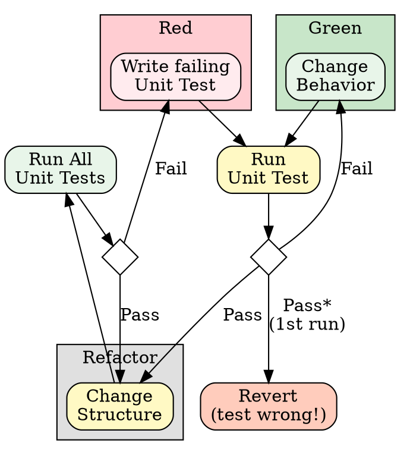

# Test-Driven Development (TDD)

## Overview

Write the test first. Watch it fail. Write minimal code to pass.

**Core principle:** If you didn't watch the test fail, you don't know if it tests the right thing.

**Violating the letter of the rules is violating the spirit of the rules.**

## When to Use

**Always:**
- New features
- Bug fixes
- Behavior changes

**Exceptions (ask your human partner):**
- Throwaway prototypes
- Generated code
- Configuration files
- Pure refactoring (no behavior change)

Thinking "skip TDD just this once"? Stop. That's rationalization.

## The Iron Law

```
NO PRODUCTION CODE WITHOUT A FAILING TEST FIRST
```

Write code before the test? Delete it. Start over.

**No exceptions:**
- Don't keep it as "reference"
- Don't "adapt" it while writing tests
- Don't look at it
- Delete means delete

Implement fresh from tests. Period.

## Red-Green-Refactor

The TDD cycle with decision points:



**Key insight:** A test that passes on the first run (before writing implementation) indicates the test is wrong—either it doesn't test new behavior, or the behavior already exists. Remove or rewrite such tests.

### RED - Write Failing Test

Write one minimal test showing what should happen.

<Good>
```typescript
test('retries failed operations 3 times', async () => {
  // Arrange
  const testObj = new RetryService();
  let attempts = 0;
  const operation = () => {
    attempts++;
    if (attempts < 3) throw new Error('fail');
    return 'success';
  };

  // Act
  const actual = await testObj.execute(operation);

  // Assert
  expect(actual).toBe('success');
  expect(attempts).toBe(3);
});
```
Clear name, AAA pattern, tests real behavior, one thing
</Good>

<Bad>
```typescript
test('retry works', async () => {
  const mock = jest.fn()
    .mockRejectedValueOnce(new Error())
    .mockRejectedValueOnce(new Error())
    .mockResolvedValueOnce('success');
  await retryOperation(mock);
  expect(mock).toHaveBeenCalledTimes(3);
});
```
Vague name, tests mock not code
</Bad>

**Requirements:**
- One behavior per test
- Clear name describing behavior
- Real code (mocks only when unavoidable)
- AAA pattern (Arrange-Act-Assert)

### Verify RED - Watch It Fail

**MANDATORY. Never skip.**

```bash
npm test path/to/test.test.ts
```

Confirm:
- Test fails (not errors)
- Failure message is expected
- Fails because feature missing (not typos)

**Test passes?** You're testing existing behavior. Fix or delete test.

**Test errors?** Fix error, re-run until it fails correctly.

### GREEN - Minimal Code

Write simplest code to pass the test.

<Good>
```typescript
async function execute<T>(fn: () => Promise<T>): Promise<T> {
  for (let i = 0; i < 3; i++) {
    try {
      return await fn();
    } catch (e) {
      if (i === 2) throw e;
    }
  }
  throw new Error('unreachable');
}
```
Just enough to pass
</Good>

<Bad>
```typescript
async function execute<T>(
  fn: () => Promise<T>,
  options?: {
    maxRetries?: number;
    backoff?: 'linear' | 'exponential';
    onRetry?: (attempt: number) => void;
  }
): Promise<T> {
  // YAGNI - no test requires this
}
```
Over-engineered
</Bad>

Don't add features, refactor other code, or "improve" beyond the test.

### Verify GREEN - Watch It Pass

**MANDATORY.**

```bash
npm test path/to/test.test.ts
```

Confirm:
- Test passes
- Other tests still pass
- Output pristine (no errors, warnings)

**Test fails?** Fix code, not test.

**Other tests fail?** Fix now.

### REFACTOR - Clean Up

After green only:
- Remove duplication
- Improve names
- Extract helpers

Keep tests green. Don't add behavior.

### Repeat

Next failing test for next feature.

## Naming Conventions

| Name | Purpose | Example |
|------|---------|---------|
| `testObj` | Object under test | `const testObj = new OrderService()` |
| `target` | Function under test | `const target = jest.fn()` |
| `target*` | Specific mock target | `targetAdd`, `targetFetch` |
| `mock*` | Mock implementation | `mockUserService`, `mockResponse` |
| `actual` | Result from code | `const actual = testObj.calculate()` |
| `expected` | Expected value | `const expected = 42` |

## AAA Pattern

Every test follows Arrange-Act-Assert:

```typescript
test('calculates discount for premium users', () => {
    // Arrange
    const testObj = new PricingService();
    const mockUser = { isPremium: true };
    const basePrice = 100;
    const expected = 90;

    // Act
    const actual = testObj.calculatePrice(basePrice, mockUser);

    // Assert
    expect(actual).toBe(expected);
});
```

Clear separation makes tests readable and maintainable.

## One Assertion Focus

Each test verifies one behavior:

<Bad>
```typescript
// Multiple behaviors in one test
test('order processing', () => {
    expect(order.validate()).toBe(true);
    expect(order.calculateTotal()).toBe(100);
    expect(order.save()).resolves.toBeDefined();
});
```
</Bad>

<Good>
```typescript
// Separate tests for each behavior
test('validates order', () => { ... });
test('calculates total', () => { ... });
test('saves order', () => { ... });
```
</Good>

"and" in test name? Split it.

## Good Tests (FIRST)

| Quality | Description | Bad Example |
|---------|-------------|-------------|
| **Fast** | Milliseconds, not seconds | Tests requiring network calls |
| **Isolated** | No shared state between tests | Tests depending on execution order |
| **Repeatable** | Same result every run | Tests depending on current time |
| **Self-validating** | Pass/fail, no manual inspection | Tests requiring log analysis |
| **Timely** | Written before/with code | Tests added "later" |

## Mocks Are Necessary Evil

**Prefer real code.** Mocks verify collaboration, not behavior.

**Mock only at boundaries:**
- External services (APIs, databases)
- Non-deterministic operations (time, random)
- Slow operations (network, file I/O)

**Never mock:**
- The code under test
- Simple collaborators that are fast and deterministic

See **jest-testing-conventions** for mocking patterns.

## Common Rationalizations

| Excuse | Reality |
|--------|---------|
| "Too simple to test" | Simple code breaks. Test takes 30 seconds. |
| "I'll test after" | Tests passing immediately prove nothing. |
| "Tests after achieve same goals" | Tests-after = "what does this do?" Tests-first = "what should this do?" |
| "Already manually tested" | Ad-hoc ≠ systematic. No record, can't re-run. |
| "Deleting X hours is wasteful" | Sunk cost fallacy. Keeping unverified code is technical debt. |
| "Keep as reference, write tests first" | You'll adapt it. That's testing after. Delete means delete. |
| "Need to explore first" | Fine. Throw away exploration, start with TDD. |
| "Test hard = design unclear" | Listen to test. Hard to test = hard to use. |
| "TDD will slow me down" | TDD faster than debugging. Pragmatic = test-first. |
| "Manual test faster" | Manual doesn't prove edge cases. You'll re-test every change. |
| "Existing code has no tests" | You're improving it. Add tests for existing code. |

## Red Flags - STOP and Start Over

- Code before test
- Test after implementation
- Test passes immediately (first run)
- Can't explain why test failed
- Tests added "later"
- Rationalizing "just this once"
- "I already manually tested it"
- "Tests after achieve the same purpose"
- "It's about spirit not ritual"
- "Keep as reference" or "adapt existing code"
- "Already spent X hours, deleting is wasteful"
- "TDD is dogmatic, I'm being pragmatic"
- "This is different because..."

**All of these mean: Delete code. Start over with TDD.**

## Verification Checklist

Before marking work complete:

- [ ] Every new function/method has a test
- [ ] Watched each test fail before implementing
- [ ] Each test failed for expected reason (feature missing, not typo)
- [ ] Wrote minimal code to pass each test
- [ ] All tests pass
- [ ] Output pristine (no errors, warnings)
- [ ] Tests use real code (mocks only if unavoidable)
- [ ] Edge cases and errors covered
- [ ] AAA pattern in all tests
- [ ] One behavior per test

Can't check all boxes? You skipped TDD. Start over.

## When Stuck

| Problem | Solution |
|---------|----------|
| Don't know how to test | Write wished-for API. Write assertion first. Ask your human partner. |
| Test too complicated | Design too complicated. Simplify interface. |
| Must mock everything | Code too coupled. Use dependency injection. |
| Test setup huge | Extract helpers. Still complex? Simplify design. |
| Test passes first run | Test is wrong—delete and rewrite. |

## Integration with Double Loop

When working on user stories with acceptance criteria, TDD is the **inner loop**:

1. **Outer loop (BDD):** Write failing acceptance test in Gherkin
2. **Inner loop (TDD):** Red-Green-Refactor for each unit needed
3. **Repeat** TDD cycles until BDD test passes

See **double-loop-bdd-tdd** for the complete workflow.

## Testing Anti-Patterns

When adding mocks or test utilities, read [testing-anti-patterns.md](testing-anti-patterns.md):
- Testing mock behavior instead of real behavior
- Adding test-only methods to production classes
- Mocking without understanding dependencies

## Related Skills

| Skill | Use For |
|-------|---------|
| **jest-testing-conventions** | Jest-specific patterns (jest.fn/spyOn/mock, fake timers) |
| **double-loop-bdd-tdd** | Outer BDD loop when implementing user stories |
| **systematic-debugging** | When bugs slip through |

## Final Rule

```
Production code -> test exists and failed first
Otherwise -> not TDD
```

No exceptions without your human partner's permission.
