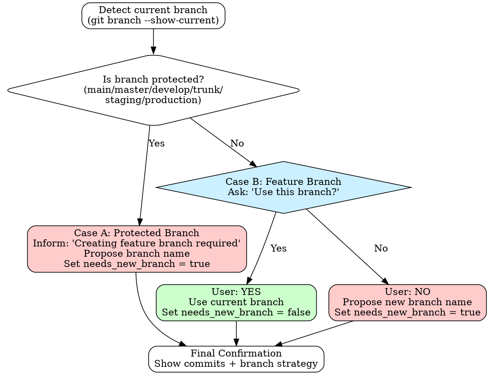

# Branch and Commit

> **Automates the workflow of analyzing uncommitted changes, grouping them into atomic commits with proper notation, and creating a clean feature branch ready for PR.**

## When to Use This Skill

Use this skill when you have **uncommitted changes** and need to:
- Group changes into logical, atomic commits
- Apply proper risk notation (Arlo's Commit Notation)
- Organize commits on current branch OR create a new feature branch
- Prepare changes for pull request review

**Do NOT use for:**
- Branch splitting or rebasing existing commits
- Amending published commits
- Reorganizing pushed commits

## Overview

This skill transforms messy working directory changes into a clean commit history by:

1. **Analyzing** all uncommitted changes (file types, diff content, intentions, security)
2. **Interviewing** you with in-depth questions to uncover missing changes and improvements
3. **Grouping** changes by intention and risk level (after understanding context from interview)
4. **Ordering** commits optimally (provably safe changes first, features last)
5. **Deciding** whether to use current branch or create new feature branch
6. **Committing** with proper commit messages
7. **Preparing** for PR creation (optional)

## Workflow

### Phase 1: Analysis (Read-Only)

The skill detects all changes and categorizes each file:

```bash
git status --porcelain
git diff HEAD --stat
git diff HEAD --cached --stat
```

For each changed file, it determines:
- **File category**: TEST, DOCS, CONFIG, SOURCE
- **Intention**: F (feature), B (bugfix), R (refactoring), D (docs), T (test), E (environment), A (automated), C (comment)
- **Change nature**: Import-only, comment-only, mixed changes

**Security Checks:**

Before proceeding, scan diffs for sensitive data:
- API keys: Long alphanumeric strings (32+ chars)
- AWS credentials: `AKIA[A-Z0-9]{16}` pattern
- Private keys: `-----BEGIN.*PRIVATE KEY-----`
- Passwords: Common variable names in plain text (like `password =` or `PASSWORD =`)
- Tokens: patterns like `token =` or `auth_token =` or `bearer =`

If potentially sensitive data is found:
1. **Warn user** with file path and line number
2. **Show the matched pattern** (partially redacted)
3. **Ask:** "This looks like sensitive data in `<file>`. Should we exclude this file or is it safe?"

**Large File Handling:**

For files with >1000 lines changed:
- Don't analyze diff content line-by-line
- Categorize by path pattern only
- Ask user: "`<file>` changed (X lines). Categorize as `<intention>` based on path?"

### Phase 2: In-Depth Interview

**This is where the magic happens.** The skill conducts a **2-4 question interview** to:

- Uncover **missing changes** you haven't thought of yet
- Identify **edge cases** not yet handled
- Explore **technical decisions and tradeoffs**
- Understand **UI/UX implications**
- Reveal **better organization** of commits

**Example questions** (contextual, not obvious):

For authentication changes:
- "How should the system handle token refresh when user has multiple tabs open?"
- "What's the UX when a user's session expires mid-form-fill?"
- "Should admin users bypass rate limiting, or should they be rate-limited differently?"

For refactoring:
- "Are there other places using this same pattern that should also be refactored?"
- "Does this change affect any performance-critical code paths?"
- "Will this make it easier or harder to add [related feature] in the future?"

For UI changes:
- "How should this behave on mobile vs desktop?"
- "What happens if the data takes 5 seconds to load?"
- "Should keyboard navigation work differently here?"

**Interview results are used to:**
- Add missing changes (e.g., "oh, I should add loading state")
- Improve existing changes (e.g., handle identified edge case)
- Inform grouping decisions (e.g., separate concerns revealed during discussion)
- Understand dependencies (e.g., "these two are related")

**Why interview first:**
- Reveals missing changes before grouping
- Uncovers dependencies that affect commit organization
- Provides context for better risk assessment
- Prevents having to regroup after discovering issues

### Phase 3: Initial Grouping

Now that we understand the full context from the interview, changes are grouped by:
- **Single intention per commit**: Features separate from refactorings separate from docs
- **Test + implementation together**: Tests and their implementation in same commit
- **Related refactorings together**: Structural changes grouped logically
- **Separate automated from manual**: Tool-generated separate from hand-written
- **Config changes separate**: Environment changes isolated
- **Dependencies revealed in interview**: Honor relationships discovered during interview

### Phase 4: Refinement

After initial grouping, refine based on:
- Any new changes added during interview
- Dependencies identified during interview
- Better logical organization revealed

### Phase 5: Risk Level Determination

**CRITICAL:** The skill **invokes `/commit-notation`** for each commit group to determine the proper annotation.

It does NOT reimplement the risk logic. Instead:

1. **Gather context** for each commit group:
   - Intention type (F/B/R/D/T/E/A/C)
   - Files changed (count, types)
   - Lines of code added/removed
   - Test coverage (do tests exist? do they pass?)
   - Change nature (imports-only? typo fix? IDE-assisted?)

2. **Invoke commit-notation skill using the Skill tool:**

   For each commit group, invoke the skill with structured context:

   ```
   Use Skill tool:
   - skill: "commit-notation"
   - args: (structured text with context)

   Example invocation context:
   "Intention: R
   Files changed: 50
   Lines of code: 150
   Test coverage: All existing tests pass
   Change nature: IDE-assisted rename 'getUserData' to 'fetchUserProfile'
   Tool-assisted: Yes (TypeScript compiler verified)

   What annotation should I use?"
   ```

3. **Parse the returned annotation:**

   The `/commit-notation` skill will return the proper annotation based on the context:
   ```
   → Returns: "a" (lowercase, provably safe)
   → Full commit message format: "a Rename getUserData to fetchUserProfile"
   ```

   Use this annotation in the commit message during Phase 8.

**Why this matters:**
- **Lowercase (a, r, d, e, t, c)** = Provably safe, don't need review, can touch MANY files
- **UPPERCASE (A, R, D, E, T, C, F, B)** = Test-verified, need review
- **!! suffix** = Risky, large, or incompletely verified
- **\*\* suffix** = Broken, WIP

### Phase 6: Commit Ordering

Commits are ordered for optimal review:

1. **e/E** (Environment) - dependencies, config (foundation)
2. **a** (Automated, provable) - IDE renames, import updates (safe, many files OK)
3. **r/R** (Refactoring) - structural prep for features
4. **t/T** (Test-only) - if standalone
5. **F/B** (Features/Bugfixes) - in dependency order (main review focus)
6. **A** (Automated, validated) - formatter runs, bulk changes
7. **d/D** (Documentation) - standalone docs
8. **c/C** (Comments) - comment-only

**Rationale:**
- **Lowercase first** - Provably safe, don't need review, clear the noise
- **Infrastructure before behavior** - Enable subsequent work
- **Refactoring before features** - Prepare the ground
- **Features last** - Main review focus, reviewers see cleaned-up code

### Phase 7: User Interaction

**Step 1: Detect current branch:**
```bash
current_branch=$(git branch --show-current)
```

**Branch Decision Flowchart:**



**Step 2: Branch decision logic:**

**Case A: User on main/master/develop/trunk**
- Inform: "You're on `<branch>`. Creating a feature branch is required."
- Propose branch name based on detected ticket or first commit
- Allow custom input
- Mark: `needs_new_branch = true`

**Case B: User on feature branch**
- Ask: "You're on `<current-branch>`. Use this branch for commits?"
  - **Yes** → Mark: `needs_new_branch = false`, use existing branch
  - **No** → Propose new branch name, mark: `needs_new_branch = true`

**Step 3: Final confirmation** - Show refined commits with:
- Commit notation (e.g., `F: Add user authentication`)
- Files included
- Ticket number (if applicable)
- Branch strategy:
  - If `needs_new_branch = false`: "Using current branch: `<name>`"
  - If `needs_new_branch = true`: "Creating new branch: `<name>`"

Options: Proceed / Adjust / Cancel

### Phase 8: Execution

**Step 1: Create branch (only if `needs_new_branch = true`):**
```bash
# Create and switch to new branch
# Skip this step if using existing branch
git checkout -b <branch-name>
```

**Step 2: Create commits:**

For each commit group:

```bash
# Stage files
git add <file1> <file2> ...

# Create commit message using commit-notation format
git commit -m "$(cat <<'EOF'
X: Summary in active voice

#TICKET-123
EOF
)"
```

**Project Override:** Use `#` prefix for ticket numbers (e.g., `#FOO-123`)
- This overrides Quatico standard which uses no prefix
- Required for this project's conventions

**Step 3: Push commits:**

```bash
# Always check if branch tracks remote (regardless of needs_new_branch flag)
# This handles edge case: user on local-only branch that doesn't track remote yet

current_branch=$(git branch --show-current)

if git rev-parse --abbrev-ref @{upstream} &>/dev/null; then
  # Branch already tracks remote - just push
  echo "Pushing to existing upstream..."
  git push
else
  # Branch doesn't track remote yet - set upstream and push
  # (Can happen even if needs_new_branch=false: user on local-only feature branch)
  echo "Setting upstream and pushing..."
  git push -u origin "$current_branch"
fi
```

**Key insight:** Don't rely solely on `needs_new_branch` flag. A user might be on an existing local branch that never tracked remote. Always check tracking status to determine correct push command.

### Phase 9: PR Preparation (Optional)

**Two-step question workflow:**

1. **Ask:** "Would you like a PR description?"
   - If NO → Done
   - If YES → Continue to step 2

2. **Ask:** "How should I provide the PR description?"
   - **Option A:** "Just generate markdown description" → Generate and display markdown
   - **Option B:** "Create the PR with description" → Chain to `handling-pull-requests` skill

**Why two steps:**
- You might want description ready but create PR manually
- You might want to edit description before creating PR
- You might just want commits without any PR preparation

## Implementation Notes

When executing this skill, Claude should use the following tools and patterns:

### Tools to Use

1. **Bash tool** for all git operations:
   ```bash
   # Detection
   git status --porcelain
   git diff HEAD
   git diff HEAD --stat

   # Execution
   git add <files>
   git commit -m "<message>"
   git push -u origin <branch>
   ```

2. **AskUserQuestion tool** for interview phase:
   - Minimum 2 questions, maximum 4
   - Use `multiSelect: false` (one answer per question)
   - Provide 2-4 options per question
   - Questions must be contextual, not obvious

3. **Skill tool** to invoke `/commit-notation`:
   - Pass context as structured text in args parameter
   - Parse response for annotation
   - Use annotation in commit message

4. **Read tool** for analyzing file contents (if needed):
   - Check file patterns
   - Analyze diff content for security issues

### Protected Branches Configuration

The skill treats these branches as **"protected"** - requiring new branch creation:
- `main`
- `master`
- `develop`
- `trunk`
- `staging`
- `production`

When current branch matches any of these, the skill will **require** creating a feature branch (Case A logic).

**Detection logic:**
```bash
current_branch=$(git branch --show-current)
protected_branches=("main" "master" "develop" "trunk" "staging" "production")

if [[ " ${protected_branches[@]} " =~ " ${current_branch} " ]]; then
  # Case A: Protected branch - must create feature branch
  echo "You're on protected branch '$current_branch'. Creating a feature branch is required."
  # Propose branch name...
else
  # Case B: Feature branch - ask user preference
  echo "You're on '$current_branch'. Use this branch for commits?"
  # Get user choice...
fi
```

**Branches NOT in this list** are considered "feature branches" and trigger the "use this branch?" prompt.

**Edge cases:**
- `release/1.0` → Considered feature branch (ask user)
- `hotfix/critical` → Considered feature branch (ask user)
- Custom base branches → If you use different base branch names (e.g., `dev` instead of `develop`), add them to the protected list

### Implementation Flow

```
1. Run git commands (Bash)
2. Analyze changes (pattern matching, Read tool if needed)
3. Check for security issues (scan diffs)
4. Interview user (AskUserQuestion - 2-4 contextual questions)
5. Group changes based on interview insights
6. For each group:
   a. Gather context
   b. Invoke /commit-notation (Skill tool)
   c. Store annotation for later
7. Detect current branch (Bash - git branch --show-current)
8. Branch decision:
   - If on main/master/develop/trunk: Propose new branch, set needs_new_branch=true
   - If on feature branch: Ask "Use this branch?", set needs_new_branch accordingly
9. Show proposed commits with branch strategy (text output)
10. Get confirmation (AskUserQuestion or wait for approval)
11. If needs_new_branch=true: Create branch (Bash - git checkout -b)
12. Execute commits (Bash - git add, git commit)
13. Push commits:
    - If needs_new_branch=true: git push -u origin <branch-name>
    - If needs_new_branch=false: git push
14. Optional: PR workflow (two-step questions)
```

### Pattern: Invoking commit-notation

For each commit group:

```typescript
// Gather context
const context = {
  intention: "F",  // or B, R, D, T, E, A, C
  filesChanged: 2,
  linesOfCode: 15,
  testCoverage: "Unit tests added and passing",
  changeNature: "Added email validation function",
  toolAssisted: "Manual implementation"
};

// Invoke via Skill tool
// skill: "commit-notation"
// args: `
// Intention: ${context.intention}
// Files changed: ${context.filesChanged}
// Lines of code: ${context.linesOfCode}
// Test coverage: ${context.testCoverage}
// Change nature: ${context.changeNature}
// Tool-assisted: ${context.toolAssisted}
//
// What annotation should I use?
// `

// Parse response
// Expected response format: annotation letters like "F" or "a" or with risk suffix like "R" with double-bang
// Use in commit message: "<annotation> <summary>"
```

### Pattern: Interview Questions

Use AskUserQuestion with structure:

```typescript
// Example for authentication changes
{
  questions: [
    {
      question: "How should the system handle token refresh when user has multiple tabs open?",
      header: "Multi-tab auth",
      multiSelect: false,
      options: [
        {
          label: "Sync across tabs",
          description: "Use BroadcastChannel to sync token refresh across all tabs"
        },
        {
          label: "Independent refresh",
          description: "Each tab manages its own token refresh independently"
        },
        {
          label: "Single leader tab",
          description: "One tab handles refresh, others listen for updates"
        }
      ]
    },
    {
      question: "What's the UX when a user's session expires mid-form-fill?",
      header: "Session expiry",
      multiSelect: false,
      options: [
        {
          label: "Save draft & redirect",
          description: "Save form data locally, then redirect to login"
        },
        {
          label: "Modal login",
          description: "Show login modal overlay, preserve form state"
        },
        {
          label: "Lose data & redirect",
          description: "Clear form and redirect to login page"
        }
      ]
    }
  ]
}
```

## Error Handling

### Git Command Failures

**If `git status`, `git diff`, or analysis commands fail:**

1. Show the error to user
2. Ask: "Git command failed: `<error>`. How should I proceed?"
3. Options:
   - Retry the command
   - Skip this step
   - Abort the skill

**If `git add` fails:**

1. Show which files failed
2. Show the error message
3. Ask: "Failed to stage `<files>`: `<error>`. Continue with successfully staged files?"

**If `git commit` fails due to hooks:**

1. Show hook output
2. **DO NOT use `--no-verify` without permission**
3. Ask: "Pre-commit hook failed: `<output>`. What should I do?"
4. Options:
   - Fix the issue and retry
   - Skip hooks with --no-verify (requires explicit user permission)
   - Abort

**If `git push` fails:**

1. Show push error
2. Common causes: authentication, branch exists upstream, conflicts
3. Ask user how to proceed (don't retry automatically)

### Branch Already Exists

**If proposed branch name exists (only relevant when creating new branch):**

1. Check if it's the current branch
2. If current: "Already on branch `<name>`. Use this branch for commits?"
   - This should have been caught in Phase 7 detection
3. If different: "Branch `<name>` exists. Choose different name or switch to it?"

**If user chose to use current branch in Phase 7:**
- No branch creation, proceed directly to commits

### Detached HEAD State

**If `git branch --show-current` returns empty string:**

1. User is in **detached HEAD** state (not on any branch)
2. Detect with additional check:
   ```bash
   current_branch=$(git branch --show-current)
   if [ -z "$current_branch" ]; then
     # Detached HEAD state
     echo "You're not on a branch (detached HEAD state)."
   fi
   ```

3. **Inform user:** "You're in detached HEAD state (not on any branch). Creating a feature branch is required to save your commits."

4. **Propose branch name** based on:
   - Current commit: `git log -1 --format=%s` (use commit message)
   - Or ticket number if detected
   - Or generic: `feature/detached-work-$(date +%s)`

5. **Proceed with Case A logic** (mandatory branch creation)

**Why this matters:** Commits made in detached HEAD are easy to lose. The skill protects users by forcing branch creation.

### No Changes Detected

**If `git status` shows no changes:**

1. Inform user: "No uncommitted changes detected."
2. Ask: "Should I check stashed changes or staged changes only?"

### Security Check Failures

**If sensitive data detected:**

1. **STOP** before grouping
2. Show file path and line number (redact actual value)
3. Example: "Potential API key in `src/config.ts:12` (pattern: `AKIA...`)"
4. Ask: "This looks sensitive. Options:"
   - Exclude this file from commits
   - It's safe (test data, example)
   - Abort and let me remove it

### Interview Reveals Blockers

**If interview uncovers issues:**

1. User says: "Oh, I need to add feature X first"
2. Pause the workflow
3. Inform: "Sounds like you need to make additional changes. Run this skill again when ready."

### Large File Warnings

**For files >1000 lines changed:**

1. Show warning: "`package-lock.json` changed (5000 lines)"
2. Ask: "Categorize as E (environment) without detailed analysis?"
3. Don't try to analyze massive diffs line-by-line

## Ticket Number Detection

The skill automatically detects ticket numbers:

1. **Check branch name**: Look for pattern `XXX-123` (extract without `#`)
2. **Check recent commits**: `git log origin/main..HEAD --oneline` (look for `#XXX-123`)
3. **Ask user**: If not found

**Format in commit:** Add `#` prefix when writing commit message (e.g., `#FOO-123`)

## Commit Message Format

Based on `/commit-notation` skill with **project override for ticket format**:

```
<risk-level><intention>[: ]<summary>

#<TICKET-NUMBER>
```

**Separator Convention:**
- **UPPERCASE intentions**: Use `:` separator (e.g., `F: Add feature`, `B: Fix bug`)
- **Lowercase intentions**: Omit separator (e.g., `a Rename method`, `r Extract function`)
- **Rationale**: Lowercase = provably safe, less formal notation

Examples:
- `F: Add user authentication endpoint` + `#FOO-123` (uppercase with `:`)
- `r Extract calculateTotal method` + `#FOO-123` (lowercase without `:`)
- `B` with risk suffix: `Fix race condition in event handler` + `#BAR-456` (uppercase with `:`)
- `E: Add axios-retry dependency` + (optional ticket)
- `a Update imports after file move` + `#FOO-123` (lowercase without `:`)

## Change Categorization

### Intention Detection (F/B/R/D/T/E/A/C)

**Feature (F) vs Bugfix (B):**
```bash
# Check for bug-related keywords
git diff <file> | grep -iE "fix|bug|error|crash|issue|repair"
# Present → B, Absent → F

# Check ticket number
ticket =~ /BUG-\d+|BUGFIX-\d+/ → B
```

**Refactoring (R) vs Automated (A):**
```bash
# Refactoring: specific, named changes (extract, inline, rename)
# Automated: bulk operations, formatter, tool-generated

# Import-only changes → A (automated)
git diff <file> | grep -v "^[+-]import\|^[+-]require" | grep "^[+-]" | wc -l
# If 0 → imports only → A
```

**Test-only (T):**
```bash
# File is test file AND no source files in same group
path =~ /\.(spec|test)\.(ts|js|tsx|jsx)$/
```

**Documentation (D):**
```bash
# Markdown files, README, docs/
path =~ /\.md$|^docs\//
```

**Environment (E):**
```bash
# Config files, dependencies
path =~ /\.(json|yml|yaml)$|package\.json|tsconfig/
```

**Comment (C):**
```bash
# Comment-only changes in source
# Detect by checking if all diff lines are comments
```

### Context for commit-notation

For each commit group, collect:
- **Intention**: F/B/R/D/T/E/A/C
- **File count**: How many files in this commit
- **LoC**: Lines added + removed
- **Test status**: Tests exist? Tests pass?
- **Change nature**: Describe what changed (imports-only, typo fix, new function, etc.)
- **Tool-assisted**: IDE refactoring? Manual edit?

Then invoke `/commit-notation` with this context to get the proper annotation.

## Integration with Existing Skills

**With commit-notation (CRITICAL - Active Integration):**
- **Invoke `/commit-notation` for EACH commit group** to determine risk level
- Provide context: intention, LoC, file count, change nature, test status
- Use the annotation it returns (like `x` or `X` or with suffixes like `X!!` or `X**`)
- This ensures 100% consistency with manual commits
- Also use for final message formatting

**With commit:**
- Follow "one concern per commit" principle
- Respect "what belongs together" guidelines
- Reference for atomic commit rules

**With handling-pull-requests:**
- Two-step PR workflow after commits
- Can generate markdown description or create full PR
- Commits already use proper notation for PR description generation

## Examples

### Example 1: Using Current Branch

**Scenario:**
- Already on branch: `feature/auth-improvements`
- Changes: authentication improvements

**Changes:**
- `src/auth.ts` - improved token validation
- `src/auth.spec.ts` - additional tests

**Phase 7 interaction:**
```
You're on `feature/auth-improvements`. Use this branch for commits?
→ Yes
```

**Result:**
```bash
# No branch creation
# Commits directly to feature/auth-improvements

# Commit 1
F: Improve token validation logic

#FOO-123

# Push
git push
```

### Example 2: Simple Feature (New Branch)

**Changes:**
- `src/auth.ts` - new authentication function
- `src/auth.spec.ts` - unit tests

**Result:**
```bash
# Commit 1
F: Add user authentication endpoint

#FOO-123
```

### Example 3: Mixed Changes

**Changes:**
- `src/feature.ts` - new feature
- `src/feature.spec.ts` - tests
- `README.md` - documentation
- `package.json` - new dependency

**Interview reveals:** "Should add loading state for async operation"

**Result:**
```bash
# Commit 1
E: Add axios dependency

#FOO-123

# Commit 2 (after adding loading state based on interview)
F: Add data fetching feature with loading state

#FOO-123

# Commit 3
D: Document data fetching API

#FOO-123
```

### Example 4: IDE Rename

**Changes:**
- 50 files changed
- All changes: `oldMethod` → `newMethod`
- TypeScript verified

**Result:**
```bash
# Commit 1
a Rename oldMethod to newMethod

#FOO-123
```

Note: **Lowercase `a`** because provably safe (IDE-assisted, type-checked)
Note: **All 50 files in one commit** because it's safe to do so

### Example 5: Typo Fix Across Docs

**Changes:**
- 10 markdown files
- All changes: `recieve` → `receive`

**Result:**
```bash
# Commit 1
d Fix typo: recieve → receive
```

Note: **Lowercase `d`** because provably safe (simple typo fix)
Note: **All 10 files in one commit** because it's safe to do so

## Success Criteria

✓ Skill correctly categorizes files by intention (F/B/R/D/T/E/A/C)
✓ Conducts in-depth interview (2-4 contextual questions)
✓ For each commit group, invokes `/commit-notation` to determine risk level
✓ Risk levels match what commit-notation returns
✓ Commits grouped logically (test+impl together, intentions separate)
✓ Provably safe commits (lowercase) can touch many files without being split
✓ Commits ordered optimally (lowercase first, then UPPERCASE, features last)
✓ Detects current branch and offers to use it (if on feature branch)
✓ Creates new branch only when user chooses to (or when on main/master/develop)
✓ Correctly handles both workflows: current branch vs new branch
✓ Two-step PR workflow works (markdown generation + optional PR creation)
✓ Uses `#` prefix for ticket numbers in commit messages
✓ Handles detached HEAD state gracefully (forces branch creation)
✓ Always checks upstream tracking status before pushing (not just flag-based)
✓ Correctly identifies protected vs feature branches using explicit list
✓ Handles local-only branches (no upstream tracking) without errors

## Common Pitfalls

**Don't:**
- Reimplement risk level logic (use `/commit-notation` instead)
- Split provably safe changes across multiple commits
- Skip the interview phase (it reveals critical improvements)
- Create PR without asking user preference
- Force branch creation when user is already on a feature branch
- Forget to detect current branch before proposing new one
- Forget `#` prefix on ticket numbers

**Do:**
- Invoke `/commit-notation` for every commit group
- Ask in-depth, contextual questions during interview
- Allow many files in lowercase commits (they're provably safe)
- Detect current branch and ask if user wants to use it
- Create new branch only when explicitly chosen or on main/master/develop
- Give user choice on PR description (markdown vs full PR)
- Use `#FOO-123` format for ticket numbers

## See Also

- [REFERENCE.md](REFERENCE.md) - Detailed categorization rules and examples
- `/commit-notation` - Commit message formatting and risk level logic
- `/commit` - Atomic commit principles
- `/handling-pull-requests` - PR creation workflow
