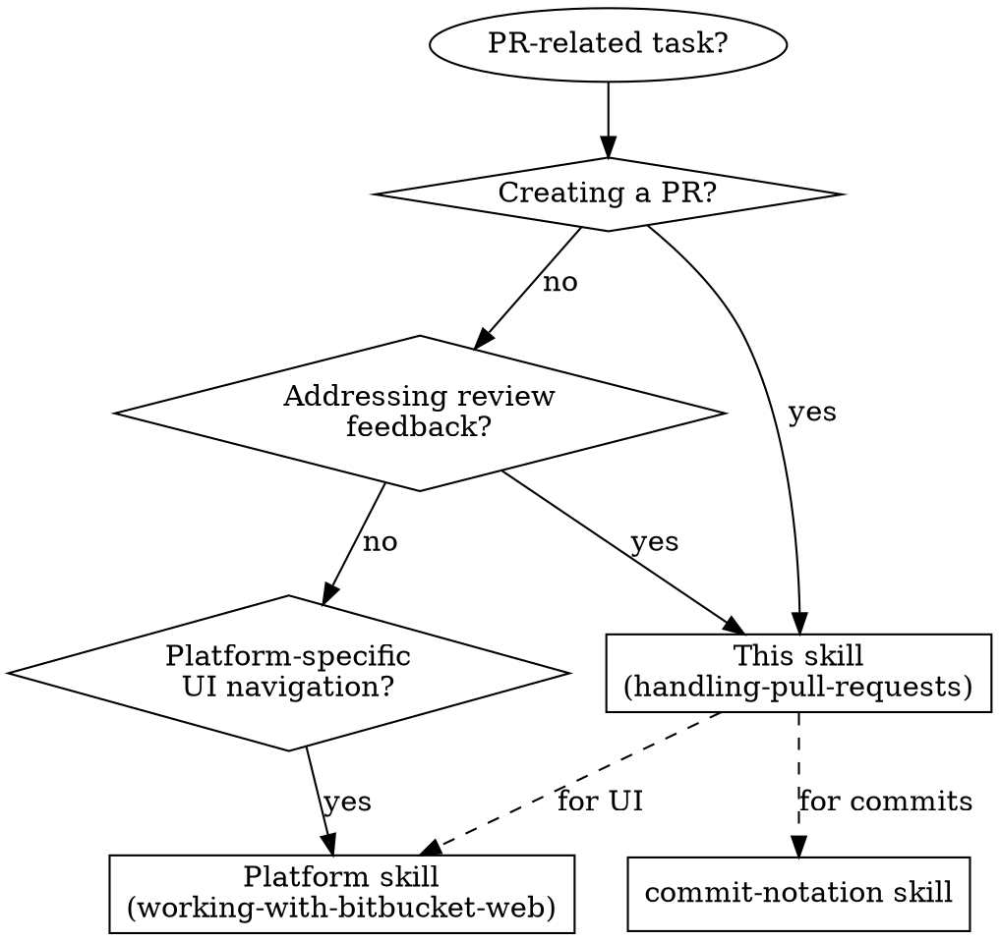

# Handling Pull Requests

## When to Use This Skill



---

## PR Creation Workflow

### Pre-flight Checklist

```
- [ ] Branch pushed to remote
- [ ] All commits follow commit-notation
- [ ] Tests passing locally
- [ ] Reviewer identified
```

### PR Description Template

```markdown
## Summary
[1-3 sentences: what this PR does and why]

## Changes
- Change 1
- Change 2

## Test plan
- [ ] Test case 1
- [ ] Test case 2

---
Generated with Claude Code
```

### Steps

1. **Push branch** if not already pushed
2. **Navigate to PR creation** (use platform skill for UI)
3. **Fill description** using template above
4. **Add reviewers** as identified
5. **Create PR**

---

## Addressing Review Feedback

### Process

1. **Read ALL comments first** — don't fix piecemeal
2. **Categorize each comment**:
   - **Question** → needs reply
   - **Change request** → needs code change + reply
   - **Approval/praise** → acknowledge or resolve
3. **Make code changes** for all change requests
4. **Commit with notation**: `b: Address review feedback` (or more specific)
5. **Reply to comments** explaining what was done
6. **Push changes**

### Comment Response Checklist

```
- [ ] Read all comments
- [ ] Make code changes
- [ ] Commit changes
- [ ] Reply to each comment
- [ ] Push
```

---

## Replying to Comments

### When to Reply vs Resolve

| Action | Use When |
|--------|----------|
| **Reply** | Questions, discussions, explanations, disagreements |
| **Resolve** | Task completed, feedback acknowledged and implemented |

### AI Signature Convention

When Claude posts comments on behalf of a user, **always sign**:

```
🤖 – Claude
```

This prevents impersonation and maintains transparency.

### Reply Guidelines

- Be concise and direct
- Reference specific code changes if applicable
- Use platform's rich text editor carefully (see platform skill)

---

## Integration with Other Skills

| Skill | Use For |
|-------|---------|
| `commit-notation` | Commit messages (F:, B:, R:, etc.) |
| `working-with-bitbucket-web` | Bitbucket UI navigation |
| `writing-clearly-and-concisely` | PR descriptions and comments |

---

## Common Mistakes

| Mistake | Fix |
|---------|-----|
| Fixing comments one-by-one | Read ALL first, then batch changes |
| Forgetting AI signature | Always add `🤖 – Claude` to AI comments |
| Using markdown bullets in rich text | Use toolbar buttons or platform skill guidance |
| Not pushing after replying | Push after all replies done |
