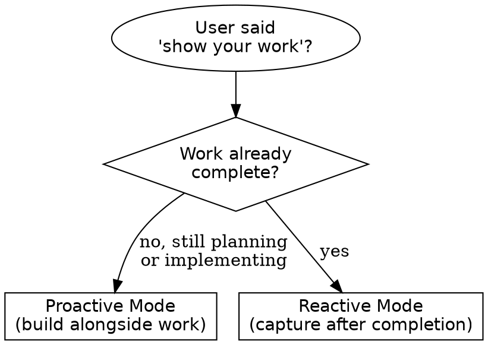
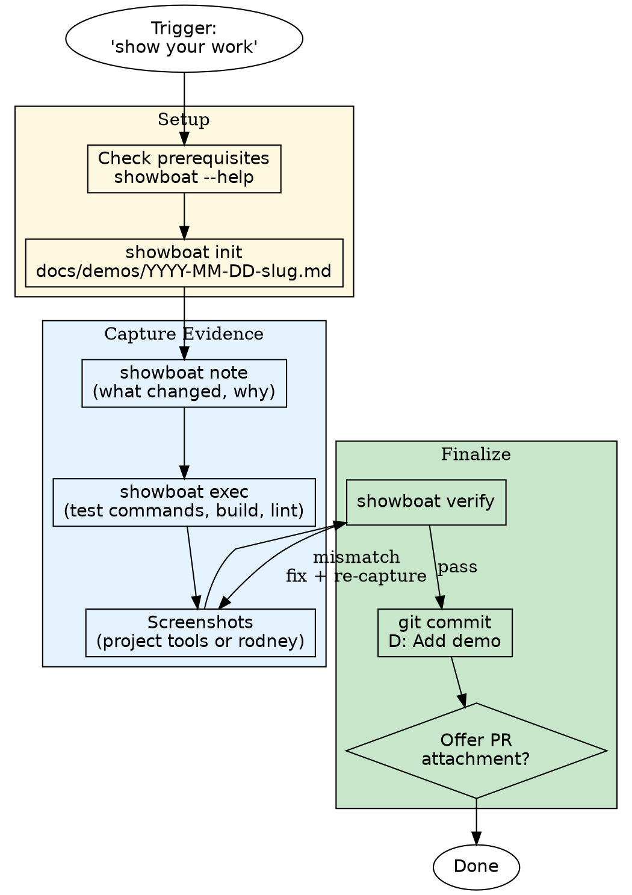

# Show Your Work

Create executable demo documents that prove completed work — tests passing, UI rendering correctly, changes working as intended.

Uses **showboat** for document assembly and **rodney** (or project-native tools) for browser screenshots. Run `./install-dependencies.sh` for one-time setup.

> **"The `--help` text acts like a Skill."** — Run `showboat --help` and `rodney --help` at runtime for full command reference. This skill covers WHEN and WHY, not HOW to use the tools.

## When to Use



| Trigger Phrase | Mode |
|---------------|------|
| "show your work" | Either (depends on timing) |
| "make a demo", "create a demo", "demo this", "demo time" | Either |
| "demonstrate the feature/fix/what changed" | Either |
| "show what you built", "show me the results" | Reactive |
| "prove it works", "prove your changes work", "prove the fix works" | Reactive |
| "record what you did", "write up what you built" | Reactive |
| "capture the evidence", "document the results" | Reactive |

## Two Modes

**Proactive** (during planning): Add a "Demo" section to the implementation plan listing which commands to capture and which screenshots to take. Build the showboat document incrementally as each step completes.

**Reactive** (after completion): Review what was accomplished (`git diff`, task context), then build the demo document retrospectively — re-run key commands and capture the final state.

## Workflow



### Checklist

```
- [ ] Check prerequisites (showboat --help)
- [ ] showboat init docs/demos/YYYY-MM-DD-<slug>.md "Title"
- [ ] showboat note — what changed and why
- [ ] showboat exec — test runs, build output, API calls
- [ ] Screenshots if UI changed (see tool selection below)
- [ ] showboat verify — confirm outputs are reproducible
- [ ] Commit demo (commit-notation: D intention)
- [ ] Offer to attach key sections to PR description
```

## Screenshots

**Prefer tools already in the project** — avoids adding dependencies and reuses existing test infrastructure.

| If the project uses... | Use for screenshots |
|------------------------|---------------------|
| Playwright (BDD tests, MCP debugging) | Reuse test artifacts or Playwright's screenshot API |
| Cypress | Test runner output or `cy.screenshot()` |
| Other test runner with screenshots | Reuse existing test artifacts |
| None of the above | `uvx rodney` (see `rodney --help`) |

Embed any screenshot into the showboat document with `showboat image <doc> <image-path>`.

## Output Location

| Situation | Location | Committed? |
|-----------|----------|------------|
| Default | `docs/demos/` | Yes |
| User specifies non-git destination | `tmp/` | No |
| Project rules specify another location | Follow project rules | Depends |

**File naming:** `docs/demos/YYYY-MM-DD-<slug>.md` with images alongside as `*-<description>.png`.

## Attaching to Pull Requests

After creating the demo, **offer** to embed key sections (test output, screenshots) in the PR description under a `## Demo` heading. Cross-reference with **handling-pull-requests** skill for PR conventions.

Do NOT force-attach — ask: "Would you like me to add demo highlights to the PR description?"

## Common Mistakes

| Mistake | Fix |
|---------|-----|
| Skipping `showboat verify` | Always verify before committing — catches output drift |
| Demo in `tmp/` when it should be committed | Default is `docs/demos/`. Use `tmp/` only for non-git destinations |
| Duplicating tool flags in this skill | Read `--help` at runtime — keeps skill lean and up-to-date |

## Integration with Other Skills

| Skill | Integration |
|-------|-------------|
| `commit-notation` | Demo commits use `D` intention (documentation) |
| `commit` | Demo document + images = one atomic commit |
| `handling-pull-requests` | Offer to embed demo highlights in PR description |
| Plan review skills | When reviewing a plan, suggest adding a demo step if none exists |
| `double-loop-bdd-tdd` | BDD test screenshots can feed directly into showboat documents |
