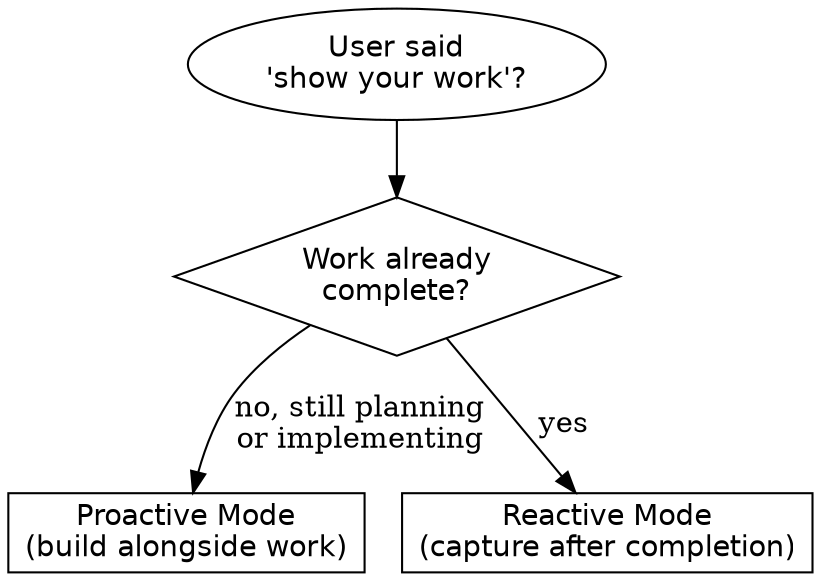
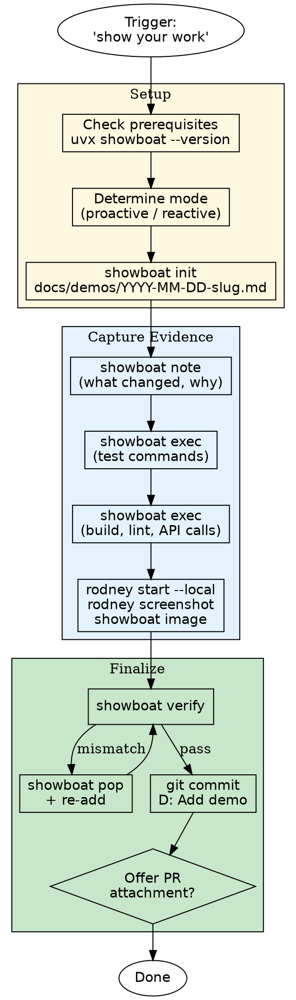

# Show Your Work

Create executable demo documents that prove completed work — tests passing, UI rendering correctly, changes working as intended.

Uses **showboat** for document assembly and **rodney** for browser screenshots. Both are CLI tools that work identically in Claude Code and Cursor.

## Prerequisites

Run `./install-dependencies.sh` for one-time setup, or check manually:

- **uv** — Python package runner (provides `uvx`)
- **showboat** — executable demo document builder
- **rodney** — Chrome automation CLI for screenshots
- **Chrome** — required by rodney

Run `showboat --help` and `rodney --help` at runtime for full flag reference — do NOT memorize flags.

## When to Use



| Trigger Phrase | Mode |
|---------------|------|
| "show your work" | Either (depends on timing) |
| "make a demo", "create a demo", "demo this", "demo time" | Either |
| "demonstrate the feature/fix/what changed" | Either |
| "show what you built", "show me the results" | Reactive |
| "prove it works", "prove your changes work", "prove the fix works" | Reactive |
| "record what you did", "write up what you built" | Reactive |
| "capture the evidence", "document the results" | Reactive |

## Two Modes

### Proactive Mode (During Planning)

Plan what to demonstrate **before** doing the work. Add a "Demo" section to your implementation plan listing which commands to capture and which screenshots to take. Build the showboat document incrementally as each step completes.

**When to use:** The user says "show your work" while work is still being planned or implemented.

### Reactive Mode (After Completion)

Work is already done. Review what was accomplished, then build the demo document retrospectively.

**When to use:** The user says "show your work" after the task is complete.

**Steps to reconstruct context:**
1. Check `git diff` or `git log` to see what changed
2. Review the task description or plan for intent
3. Identify verification commands (test suite, build, lint)
4. Check if UI changes were made (need screenshots)

## Workflow



### Checklist

```
- [ ] Check prerequisites (uvx showboat --version)
- [ ] Determine mode (proactive or reactive)
- [ ] Create docs/demos/ directory if needed
- [ ] showboat init docs/demos/YYYY-MM-DD-<slug>.md "Title"
- [ ] showboat note — what changed and why
- [ ] showboat exec — test runs, build output, API calls
- [ ] If UI: rodney screenshots (see "UI Screenshots" section)
- [ ] showboat verify — re-run all blocks, confirm outputs match
- [ ] Commit demo document (commit-notation: D intention)
- [ ] Offer to attach key sections to PR description
```

## Building the Demo Step by Step

### Initialize

```bash
mkdir -p docs/demos
uvx showboat init docs/demos/2026-02-17-jwt-auth.md "Feature: JWT Authentication"
```

### Add Context

```bash
uvx showboat note docs/demos/2026-02-17-jwt-auth.md \
  "Added JWT-based authentication to /api/login. Tests and UI verification below."
```

### Capture Command Output

```bash
uvx showboat exec docs/demos/2026-02-17-jwt-auth.md bash "pnpm test -- --grep auth"
uvx showboat exec docs/demos/2026-02-17-jwt-auth.md bash "pnpm build"
```

Each `exec` runs the command, captures stdout, and appends both the command and its output to the document.

### Fix Mistakes

```bash
# Remove last section if output was wrong
uvx showboat pop docs/demos/2026-02-17-jwt-auth.md
# Re-add corrected version
uvx showboat exec docs/demos/2026-02-17-jwt-auth.md bash "pnpm test -- --grep auth"
```

### Verify Reproducibility

```bash
uvx showboat verify docs/demos/2026-02-17-jwt-auth.md
```

Re-runs all exec blocks and diffs output against what was recorded. Fix any mismatches before committing.

## UI Screenshots with Rodney

Use rodney when the change includes UI — forms, pages, components, visual output.

### Lifecycle

```bash
# Start Chrome (scoped to project directory)
uvx rodney start --local

# Navigate and wait for page to settle
uvx rodney open http://localhost:3000/login
uvx rodney waitstable

# Capture full page
uvx rodney screenshot docs/demos/2026-02-17-jwt-auth-login.png

# Or capture specific element
uvx rodney screenshot-el ".login-form" docs/demos/2026-02-17-jwt-auth-form.png

# Embed in showboat document
uvx showboat image docs/demos/2026-02-17-jwt-auth.md \
  docs/demos/2026-02-17-jwt-auth-login.png

# Always stop Chrome when done
uvx rodney stop
```

### Key Rules

- **Always `waitstable` before `screenshot`** — prevents capturing loading states
- **Always `rodney stop` when finished** — avoids orphaned Chrome processes
- **Use `--local` flag** — scopes session to `.rodney/` in project dir, avoids conflicts
- **Add `.rodney/` to `.gitignore`** if not already present

### Accessibility Audit (Optional)

```bash
uvx rodney ax-tree --depth 3
uvx rodney ax-find --role navigation
```

Useful for proving accessibility compliance in the demo.

## Demo Document Structure

A good demo document follows this pattern:

```markdown
# Feature: [Title]

Built and verified on YYYY-MM-DD.

## What Changed

[1-3 sentence summary of what was built/fixed and why]

## Tests Pass

(showboat exec block with test command and captured output)

## Build Succeeds

(showboat exec block with build command and captured output)

## UI Verification

(screenshot embedded via showboat image)

## [Additional Evidence as Needed]

(API responses, lint output, accessibility audit, etc.)
```

## File Naming

**Documents:** `docs/demos/YYYY-MM-DD-<slug>.md`
- Derive slug from feature or ticket: `2026-02-17-jwt-auth.md`, `2026-02-17-PROJ-123-order-flow.md`

**Images:** alongside the document as `YYYY-MM-DD-<slug>-<description>.png`
- Example: `2026-02-17-jwt-auth-login-form.png`

## Output Location

| Situation | Location | Committed? |
|-----------|----------|------------|
| Default | `docs/demos/` | Yes |
| User specifies non-git destination (upload, share, post) | `tmp/` | No |
| Project rules specify another location | Follow project rules | Depends |

## Attaching to Pull Requests

After creating the demo, **offer** to embed key sections in the PR description. Cross-reference with **handling-pull-requests** skill for PR conventions.

Suggested PR description addition:

```markdown
## Demo

Key evidence from [demo document](docs/demos/YYYY-MM-DD-slug.md):

### Tests
[paste test output excerpt from showboat document]

### Screenshot

```

Do NOT force-attach — ask: "Would you like me to add demo highlights to the PR description?"

## Common Mistakes

| Mistake | Fix |
|---------|-----|
| Skipping `showboat verify` | Always verify before committing — catches output drift |
| Screenshots without `waitstable` | Add `uvx rodney waitstable` before every screenshot |
| Forgetting `rodney stop` | Always stop Chrome — use a checklist or finally pattern |
| Demo in `tmp/` when it should be committed | Default is `docs/demos/`. Use `tmp/` only for non-git destinations |
| Duplicating all showboat/rodney flags | Read `--help` at runtime instead of memorizing |
| Hardcoded ports or URLs in exec blocks | Note assumptions or use environment variables |

## Integration with Other Skills

| Skill | When to Use |
|-------|-------------|
| `commit-notation` | Demo commits use `D` intention (documentation) |
| `commit` | Demo document + images = one atomic commit |
| `handling-pull-requests` | Embedding demo highlights in PR descriptions |
