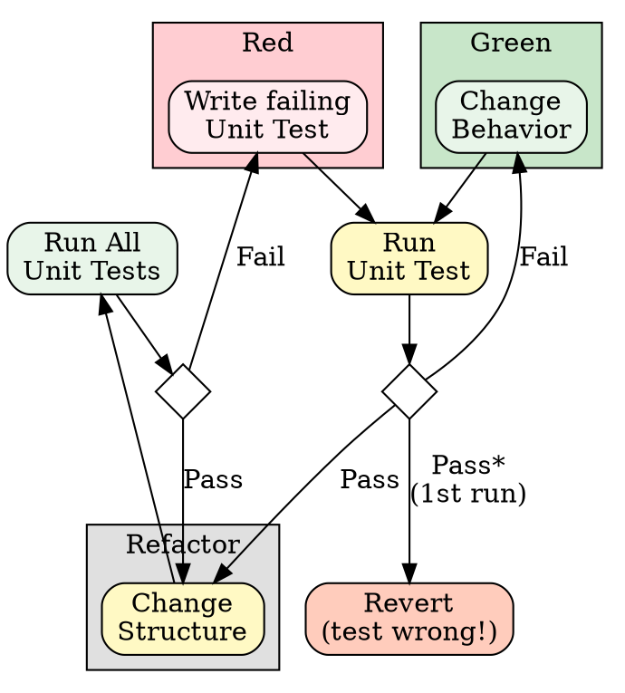

# Test-Driven Development (TDD)

## Overview

Write the test first. Watch it fail. Write minimal code to pass.

**Core principle:** If you didn't watch the test fail, you don't know if it tests the right thing.

**Violating the letter of the rules is violating the spirit of the rules.**

## When to Use

**Always:**
- New features
- Bug fixes
- Behavior changes

**Exceptions (ask your human partner):**
- Throwaway prototypes
- Generated code
- Configuration files
- Pure refactoring (no behavior change)

Thinking "skip TDD just this once"? Stop. That's rationalization.

## The Iron Law

```
NO PRODUCTION CODE WITHOUT A FAILING TEST FIRST
```

Write code before the test? Delete it. Start over. Implement fresh from tests.

Tempted to skip this? That impulse is the thing the rule is for.

## Red-Green-Refactor

The TDD cycle with decision points:



**Key insight:** A test that passes on the first run (before writing implementation) indicates the test is wrong—either it doesn't test new behavior, or the behavior already exists. Remove or rewrite such tests.

### RED - Write Failing Test

Write one minimal test showing what should happen.

<Good>
```typescript
test('retries failed operations 3 times', async () => {
  // Arrange
  const testObj = new RetryService();
  let attempts = 0;
  const operation = () => {
    attempts++;
    if (attempts < 3) throw new Error('fail');
    return 'success';
  };

  // Act
  const actual = await testObj.execute(operation);

  // Assert
  expect(actual).toBe('success');
  expect(attempts).toBe(3);
});
```
Clear name, AAA pattern, tests real behavior, one thing
</Good>

<Bad>
```typescript
test('retry works', async () => {
  const mock = jest.fn()
    .mockRejectedValueOnce(new Error())
    .mockRejectedValueOnce(new Error())
    .mockResolvedValueOnce('success');
  await retryOperation(mock);
  expect(mock).toHaveBeenCalledTimes(3);
});
```
Vague name, tests mock not code
</Bad>

**Requirements:**
- One behavior per test
- Clear name describing behavior
- Real code (mocks only when unavoidable)
- AAA pattern (Arrange-Act-Assert)

### Verify RED - Watch It Fail

**MANDATORY. Never skip.**

```bash
npm test path/to/test.test.ts
```

Confirm:
- Test fails (not errors)
- Failure message is expected
- Fails because feature missing (not typos)

**Test passes?** You're testing existing behavior. Fix or delete test.

**Test errors?** Fix error, re-run until it fails correctly.

### GREEN - Minimal Code

Write simplest code to pass the test.

<Good>
```typescript
async function execute<T>(fn: () => Promise<T>): Promise<T> {
  for (let i = 0; i < 3; i++) {
    try {
      return await fn();
    } catch (e) {
      if (i === 2) throw e;
    }
  }
  throw new Error('unreachable');
}
```
Just enough to pass
</Good>

<Bad>
```typescript
async function execute<T>(
  fn: () => Promise<T>,
  options?: {
    maxRetries?: number;
    backoff?: 'linear' | 'exponential';
    onRetry?: (attempt: number) => void;
  }
): Promise<T> {
  // YAGNI - no test requires this
}
```
Over-engineered
</Bad>

Don't add features, refactor other code, or "improve" beyond the test.

### Verify GREEN - Watch It Pass

**MANDATORY.**

```bash
npm test path/to/test.test.ts
```

Confirm:
- Test passes
- Other tests still pass
- Output pristine (no errors, warnings)

**Test fails?** Fix code, not test.

**Other tests fail?** Fix now.

### REFACTOR - Clean Up

After green only:
- Remove duplication
- Improve names
- Extract helpers

Keep tests green. Don't add behavior.

### Repeat

Next failing test for next feature.

## Stopping Rule

Red -> green -> refactor -> **stop**. One cycle ends when the test passes, the suite is
green, and the output is clean. Then either start the next failing test or report done.

**The cycle does not include:**

- Building test scaffolding, fixtures, harnesses or helpers that the current failing
  test does not require
- Re-running a suite that already passed to confirm it still passes
- Adding tests for behaviour no one asked for, found by inspecting existing code
- Refactoring tests that are green and readable

**Verification budget:** each cycle should need one red run and one green run. If you
find yourself running the same test a third time, stop and say why — the code, the test,
or your understanding is wrong. Fix that rather than adding verification around it. If a
cycle has produced more test-support code than production code, stop and say so.

**Build scaffolding only when a test needs it, and only as much as that test needs.**
Infrastructure written before there is a failing test that uses it is speculative:
delete it and let the next test pull it back in.

**When budget is tight, ship the passing slice.** Partial work that runs and is reported
honestly beats a complete verification apparatus around nothing. Do not go quiet: if the
cycle cannot close, report what passes, what fails, and what is untested.

**Stop means the cycle ends, not the work.** When an outer loop is driving — a BDD
acceptance test, a plan step, a list of requested behaviours — stopping hands control
back to it, and it decides whether another cycle is needed. Stopping is not the same as
reporting done, and this rule is never a reason to leave requested work unfinished.

## Naming, AAA and One Assertion

Variable naming (`testObj`, `target`, `mock*`, `actual`, `expected`), the
Arrange-Act-Assert layout and one-behaviour-per-test live in the
**jest-testing-conventions** skill. This skill owns the cycle; that one owns the
mechanics.

## Good Tests (FIRST)

| Quality | Description | Bad Example |
|---------|-------------|-------------|
| **Fast** | Milliseconds, not seconds | Tests requiring network calls |
| **Isolated** | No shared state between tests | Tests depending on execution order |
| **Repeatable** | Same result every run | Tests depending on current time |
| **Self-validating** | Pass/fail, no manual inspection | Tests requiring log analysis |
| **Timely** | Written before/with code | Tests added "later" |

## Mocks Are Necessary Evil

**Prefer real code.** Mocks verify collaboration, not behavior.

**Mock only at boundaries:**
- External services (APIs, databases)
- Non-deterministic operations (time, random)
- Slow operations (network, file I/O)

**Never mock:**
- The code under test
- Simple collaborators that are fast and deterministic

See **jest-testing-conventions** for mocking patterns.

## Verification Checklist

Before marking work complete:

- [ ] Every new function/method has a test
- [ ] Watched each test fail before implementing
- [ ] Each test failed for expected reason (feature missing, not typo)
- [ ] Wrote minimal code to pass each test
- [ ] All tests pass
- [ ] Output pristine (no errors, warnings)
- [ ] Tests use real code (mocks only if unavoidable)
- [ ] Edge cases and errors covered
- [ ] AAA pattern in all tests
- [ ] One behavior per test

Can't check all boxes? You skipped TDD. Start over.

Checked all boxes? Stop. Do not add an eleventh check of your own.

## When Stuck

| Problem | Solution |
|---------|----------|
| Don't know how to test | Write wished-for API. Write assertion first. Ask your human partner. |
| Test too complicated | Design too complicated. Simplify interface. |
| Must mock everything | Code too coupled. Use dependency injection. |
| Test setup huge | Extract helpers. Still complex? Simplify design. |
| Test passes first run | Test is wrong—delete and rewrite. |

## Integration with Double Loop

When working on user stories with acceptance criteria, TDD is the **inner loop**:

1. **Outer loop (BDD):** Write failing acceptance test in Gherkin
2. **Inner loop (TDD):** Red-Green-Refactor for each unit needed
3. **Repeat** TDD cycles until BDD test passes

See the outer BDD loop (outside-in development) for the complete workflow.

## Testing Anti-Patterns

When adding mocks or test utilities, read [testing-anti-patterns.md](testing-anti-patterns.md):
- Testing mock behavior instead of real behavior
- Adding test-only methods to production classes
- Mocking without understanding dependencies

## Related Skills

| Skill | Use For |
|-------|---------|
| **jest-testing-conventions** | Jest-specific patterns (jest.fn/spyOn/mock, fake timers) |
| **systematic-debugging** | When bugs slip through |
| **show-your-work** | Long-running or multi-cycle work — produce an artefact, not a claim |

## Final Rule

```
Production code -> test exists and failed first
Otherwise -> not TDD
```

No exceptions without your human partner's permission.
